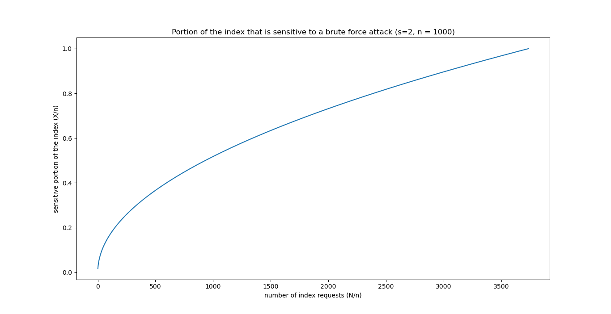
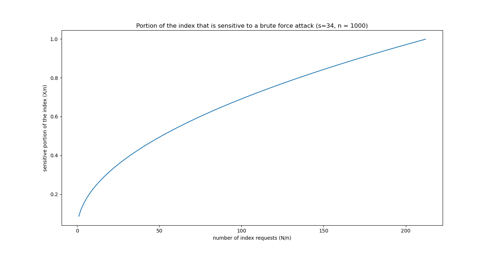
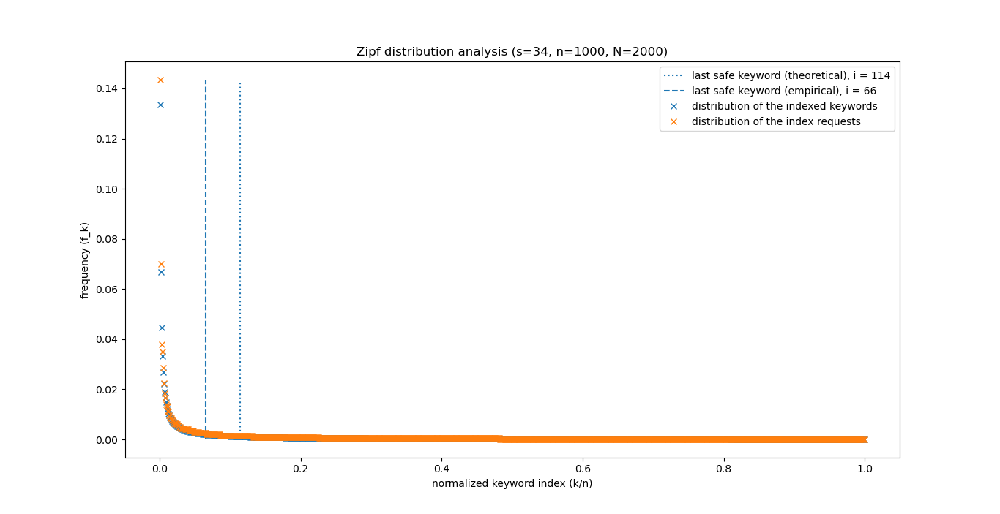

# Frequency analysis

Following the Zipf distribution, the frequency of the $k^{th}$ word the most
frequent among $n$ words is:

$$
f_{k,~n} = \frac{\frac{1}{k}}{\sum\limits_{i=1}^{n}\frac{1}{i}}
$$

Therefore, given $N$ samples the number of times of the word $k$ is drawn is
given by:

$$
D_{k,~n,~N} = \lceil N \cdot f_{k,~n} \rceil
$$

Given $s$ the security parameter, the difference between the number of times
the words $k$ and $k+s$ are drawn can be approximated by:

$$
\Delta_{s,~k,~n,~N} \sim N \cdot \left(f_{k,~n} - f_{k+s,n}\right)
$$

Then, finding the index of the words which are drawn the same number of times
as less than $s$ other words, means resolving the following equation:

$$
\begin{array}{crcl}
		& \Delta_{s,~k,~n,~N}							& \lt & 1 \\
	\iff	& \frac{N}{\sum\limits_{i=1}^n\frac{1}{i}} \cdot \frac{s}{k(k+s)} 	& \lt & 1
\end{array}
$$

Let’s note $C_{n,~N} = \frac{N}{\sum\limits_{i=1}^n\frac{1}{i}}$, then we have:

$$
\begin{array}{crcl}
		& C_{n,~N} \cdot \frac{s}{k(k+s)}	& \lt & 1 \\
	\iff 	& k^2 + s\cdot k - s\cdot C_{n,~N} 	& \gt & 0
\end{array}
$$

This is a 2nd degree polynomial which roots are:
$r_{1,~2} = \frac{1}{2} \cdot \left(s \pm \sqrt{s^2 + 4 \cdot s \cdot C_{n,~N}}\right)$.
Since the coefficient of the monomial with highest degree is positive, the
previous equation holds for all $k \gt r_2$ (since $r_1 < 0$).

Therefore, given the initial approximation, the index of the first word (ranked
by frequency) that belongs to a set of at least $s$ words which have been drawn
the same number of times is given:

$$
k_{s,~n,~N} = \left\lceil \frac{ s + \sqrt{s^2 + 4 \cdot s \cdot C_{n,~N}} }{2} \right\rceil
$$

For $s$ and $n$ given, it is possible to deduce the secure portion of the index
given the number of calls to the index:

